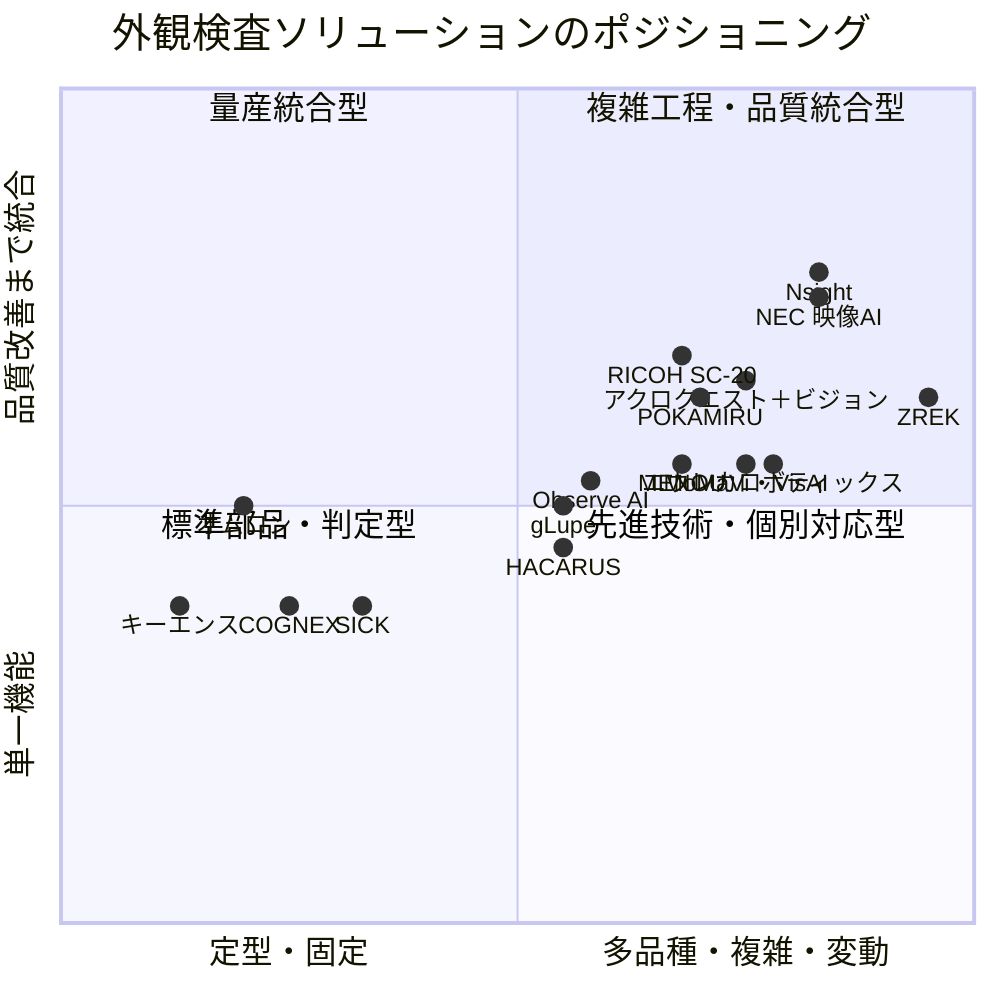

# 外観検査自動化：2軸ベンチマークと技術開発ポイント

## 1. 目的

これまでの外観検査自動化に関する調査をもとに、各社・各ソリューションの市場ポジションを2軸で整理し、今後の技術開発で狙うべき領域を明確にする。

本資料では、次の2種類のマップを使い分ける。

1. **企業・ソリューションの市場ポジションを把握する主マップ**
2. **技術開発テーマの優先順位を判断する補助マップ**

> 注：企業単位では複数の製品・事業が混在するため、原則として「企業」ではなく「製品・ソリューション」単位で評価する。

---

## 2. 主マップの推奨2軸

### 2.1 横軸：検査対象・工程の変動性

対象品や作業条件がどの程度固定されているか、または案件ごとに変わるかを示す。

| 評点 | 定義 | 代表的な対象 |
|---:|---|---|
| 1 | 定型品・定位置・一定条件 | 量産品、固定カメラ、単一品種 |
| 2 | 複数品種だが、位置・検査項目は標準化可能 | 品種切替のある量産ライン |
| 3 | 多品種で、位置・外観にばらつきがある | 少量多品種、良品学習型検査 |
| 4 | 作業・撮影条件・検査項目が変動する | 手組立、モバイル検査、大型品 |
| 5 | 品種・仕様・工程が案件ごとに変わる | 個別受注品、図面依存、作業動画 |

評価には、次の要素を含める。

- 品種数と品種変更頻度
- ワーク位置・姿勢の変動
- 検査項目・合否基準の変動
- 撮影方向・死角の多さ
- 作業順序を含む時系列変動

### 2.2 縦軸：提供価値の範囲

単なる画像判定から、品質保証・工程改善まで、ソリューションがカバーする範囲を示す。

| 評点 | 定義 |
|---:|---|
| 1 | カメラ・AIモデルなどの単一要素 |
| 2 | 撮像とOK/NG判定 |
| 3 | 設備連携、品種切替、検査記録 |
| 4 | 作業支援、品質証跡、人による確認、再学習 |
| 5 | 図面・検査仕様連携、原因分析、工程改善まで閉ループ化 |

上に行くほど、提供価値が「判定装置」から「品質改善基盤」へ広がる。

### 2.3 技術方式を主軸にしない理由

「ルールベースかAIか」「従来AIかVLMか」といった技術方式だけを2軸にすると、多くの企業が複数方式を併用しているため、配置が中央付近に集中しやすい。また、技術方式だけでは顧客価値や市場の空白が見えにくい。

そのため、技術方式は主軸ではなく、次の補助表現に使用する。

- **点の色**：ルールベース、従来AI、異常検知、VLM、ハイブリッド
- **点の形**：製品化済み、実導入、PoC・研究開発
- **点の大きさ**：公開導入実績、対象市場規模、導入成熟度

---

## 3. 各社・製品の暫定マッピング

以下は、これまでに確認した公開情報をもとにした相対評価である。数値は厳密な性能評価ではなく、比較・議論のための仮スコアである。

| 企業・製品／ソリューション | 変動性 X | 価値範囲 Y | 主な位置づけ |
|---|---:|---:|---|
| キーエンス | 1.5 | 2.5 | 標準化された量産検査、短期導入 |
| オムロン | 1.8 | 3.0 | FA・制御と一体化した量産検査 |
| COGNEX | 2.0 | 2.5 | 高度な2D／3Dマシンビジョン |
| SICK | 2.3 | 2.5 | センサ・3D・産業環境対応 |
| HACARUS Check ZERO | 3.2 | 2.8 | 少量良品学習、異常検知 |
| gLupe Inspector | 3.2 | 3.0 | 超少量データ、AI＋ルール、設備連携 |
| Observe AI | 3.3 | 3.1 | ノーコード、多品種、複数検査の組合せ |
| アダコテック POKAMIRU | 3.8 | 3.5 | 少量多品種の手組立、目視支援、画像記録 |
| RICOH SC-20 | 3.7 | 3.7 | 組立中のポカヨケ、順序確認、品質証跡 |
| MENOU | 3.7 | 3.2 | AI検査、ロボット・センサ連携 |
| マーストーケン MoMaVi／VisAI | 4.0 | 3.2 | モバイル、組立、員数、OCR |
| アクロクエスト＋ビジョン | 4.0 | 3.6 | タブレット＋生成AI＋検査記録 |
| エウレカロボティックス | 4.1 | 3.2 | 非構造環境、AIビジョン、ロボット連携 |
| NEC 映像AI | 4.3 | 4.0 | 作業認識、進捗記録、工程可視化 |
| Nsight | 4.3 | 4.1 | VLM・従来AI・ルール・モバイルの統合 |
| ZREK | 4.8 | 3.5 | VLMによる作業動画・状態理解。PoC段階 |

### 3.1 ポジショニングマップ



### 3.2 各象限の意味

#### 左下：標準部品・判定型

カメラ、画像センサ、AIモデル、標準的なOK／NG判定などを提供する領域。市場が成熟し、競合が多い。

#### 左上：量産統合型

標準化された量産ラインを対象に、設備連携や安定運用まで完成度を高めた領域。大手FA・マシンビジョンメーカーが強い。

#### 右下：先進技術・個別対応型

VLM、ロボット、モバイルなどにより複雑な対象へ対応する一方、品質保証や継続運用が発展途上の領域。

#### 右上：複雑工程・品質統合型

少量多品種、組立、大型・複雑形状品に対し、仕様理解、撮像、判定、品質証跡、工程改善まで扱う領域。今後の主要な開発候補である。

ただし、NsightやNECなどが右上へ近づいているため、単に「VLMを使う」「少量多品種に対応する」だけでは十分な差別化にならない。

---

## 4. 技術開発テーマ選定用の補助マップ

企業マップだけでは、市場の空白と自社の開発優先順位が完全には一致しない。そこで、技術開発テーマについては次の2軸で別途評価する。

- **横軸：技術・事業化の実現可能性**
- **縦軸：未充足ニーズ・差別化余地**

### 4.1 開発テーマの暫定評価

| 開発テーマ | 実現可能性 | 差別化余地 | 判断 |
|---|---:|---:|---|
| 標準2D外観検査 | 5.0 | 1.0 | 競合過多 |
| OCR・バーコード・員数確認 | 5.0 | 1.0 | 単独開発は非推奨 |
| 単純な組立有無・向き検査 | 4.5 | 2.0 | 既製品活用が基本 |
| モバイル検査 | 4.0 | 3.0 | 段階導入の入口として有効 |
| 少量良品学習・異常検知 | 4.0 | 3.0 | 単体では競争が進展 |
| 組立作業の時系列検査 | 3.0 | 4.0 | 有望 |
| 大型・複雑形状品の多視点検査 | 3.0 | 4.5 | 有望 |
| AI検査の継続運用・再学習基盤 | 4.0 | 5.0 | 最優先 |
| 検査データによる工程改善 | 4.0 | 4.5 | 最優先 |
| VLM＋図面・検査仕様＋定量判定 | 2.5 | 5.0 | 中長期の重点 |
| 品質保証可能な人・AI協調判定 | 4.0 | 5.0 | 最優先 |

### 4.2 技術開発テーママップ

```mermaid
quadrantChart
    title 技術開発テーマの優先度
    x-axis 実現性が低い --> 実現性が高い
    y-axis 差別化余地が小さい --> 差別化余地が大きい
    quadrant-1 短期重点領域
    quadrant-2 中長期研究領域
    quadrant-3 優先度低
    quadrant-4 既製品活用領域
    標準2D検査: [1.00, 0.00]
    OCR・員数確認: [1.00, 0.00]
    単純組立検査: [0.88, 0.25]
    モバイル検査: [0.75, 0.50]
    少量良品学習: [0.75, 0.50]
    組立時系列検査: [0.50, 0.75]
    大型品多視点検査: [0.50, 0.88]
    継続運用・再学習: [0.75, 1.00]
    検査データ工程改善: [0.75, 0.88]
    VLM＋仕様＋定量判定: [0.38, 1.00]
    人・AI協調判定: [0.75, 1.00]
```

---

## 5. マッピングから見える技術開発ポイント

### 5.1 AIモデル単体から「検査オーケストレーション」へ

差別化の中心は、新しいAIモデル単体ではなく、検査項目や対象に応じて複数方式を統合する仕組みに移る。

- **VLM**：図面、BOM、検査仕様、作業手順の理解
- **従来AI**：傷、欠品、向き、異常領域の検出
- **ルールベース**：寸法、位置、濃淡、OCRの定量判定
- **人**：曖昧品、未知不良、品質上重要な結果の最終判断

これらを検査項目ごとに選択・統合し、判定根拠を残す技術が重要になる。

### 5.2 「少量多品種対応」から「品種追加を容易にする仕組み」へ

少量多品種対応を掲げる製品はすでに複数存在する。次の機能まで含めて差別化する必要がある。

- 図面・仕様書からの検査項目抽出
- 検査レシピの半自動生成
- QR・現品票による品種・条件切替
- 品種間で再利用できる部品・欠陥表現
- Few-shot、異常検知、合成データの使い分け

評価KPIも判定精度だけでなく、**新規品種の立上げ時間**や**必要画像枚数**を含める。

### 5.3 作業後の検査から「作業中＋作業後」へ

単純な部品有無・向き検査は競合が多いため、次の領域へ拡張する。

- 工程飛ばし・順序違いの検出
- 工具、トルク、変位データとの照合
- 作業動画と標準手順書の比較
- 作業中のリアルタイム警告
- 完成後には見えなくなる部位の品質証跡

### 5.4 導入技術より「継続運用技術」を重点化

右上領域で特に差別化しやすいテーマである。

- 品種・設備・条件別の画像管理
- 誤判定・不明判定の自動収集
- 新旧モデルの比較・承認
- 見逃し、過検出、データドリフトの監視
- 品質基準変更とモデル変更の対応管理
- 人の修正結果を使った継続学習

「数年後も目視検査へ戻らないこと」を、製品性能・開発KPIとして扱う必要がある。

### 5.5 検査データを工程改善へ閉ループ化

- 欠陥位置・種類・程度の構造化
- 材料ロット、設備条件、工具、作業者との紐付け
- 不良傾向・変化点の検出
- 原因候補の提示
- 上流工程へのフィードバック

検査工数の削減だけでなく、「不良を流出させない」から「不良を発生させない」価値へ広げる。

### 5.6 大型・複雑形状品では「撮像保証」を開発対象にする

- CADからの検査点・撮像経路生成
- 撮像済み範囲と死角の可視化
- ロボット座標と画像の紐付け
- 同一座標における過去画像との比較
- 2D、3D、複数照明の自動切替
- 異常位置の3Dモデル上への記録

AI判定精度だけでなく、**検査すべき全面を確実に撮像したか**が品質保証上の核心になる。

---

## 6. 推奨する開発ポジション

今後狙うべきポジションは、次のように表現できる。

> 少量多品種の組立品・大型複雑品を対象に、図面・BOM・検査仕様・作業手順を理解し、固定カメラ、モバイル、ロボット撮像を使い分け、VLM・従来AI・ルールベース・人判断を統合して、品質証跡と工程改善まで継続運用できる検査基盤

### 6.1 推奨優先順位

1. **AI検査の継続運用・再学習基盤**
2. **検査データと設備・製造条件を結ぶ品質改善基盤**
3. **少量多品種のレシピ生成・品種切替**
4. **組立作業の時系列検査と品質証跡**
5. **大型・複雑形状品の撮像保証**
6. **VLMによる図面・仕様理解**

VLMは単独の最終判定器ではなく、検査仕様の理解、レシピ生成、異常説明、類似事例検索を担わせる。微細欠陥、寸法、位置、濃淡差については、従来AIとルールベースにより定量性・再現性を保証する構成が現時点では適切である。

---

## 7. 今後のベンチマーク更新方法

マップを一度作って終わりにせず、各製品について次の情報を継続的に収集する。

| 評価カテゴリ | 確認項目 |
|---|---|
| 適用対象 | 品種数、ワーク形状、組立／外観、固定／移動、2D／3D |
| 撮像 | カメラ、照明、撮像ガイダンス、多視点、撮像保証 |
| 判定 | ルール、教師ありAI、異常検知、VLM、ハイブリッド |
| 品質保証 | 精度、見逃し率、過検出率、再現性、不明判定、承認方法 |
| 導入 | 必要画像枚数、品種立上げ時間、設備連携、既存設備への後付け |
| 運用 | モデル更新、閾値変更管理、ドリフト監視、現場での保守 |
| データ活用 | トレーサビリティ、設備ログ連携、原因分析、上流フィードバック |
| 成熟度 | 技術構想、PoC、製品提供、顧客導入、複数拠点・長期運用 |

公開情報だけでは導入実績や性能条件が確認できないケースがあるため、ベンチマーク時には、導入台数、対象ワーク、検査精度、サイクルタイム、運用期間、モデル更新方法を個別に確認する。

---

## 8. まとめ

- 主マップは、**「検査対象・工程の変動性」×「提供価値の範囲」**とする。
- 技術方式は軸にせず、点の色・形・大きさで補足する。
- 開発テーマの選定では、**「技術・事業化の実現可能性」×「未充足ニーズ・差別化余地」**の補助マップを使う。
- 標準2D検査、OCR、単純な有無・向き検査は競合が多く、単独テーマとしての優先度は低い。
- 重点領域は、継続運用・再学習、検査データによる工程改善、品種追加の容易化、組立時系列検査、大型品の撮像保証である。
- 中長期的には、VLMによる仕様理解と、従来AI・ルールベースによる定量判定を統合した品質保証可能な検査基盤が有望である。
