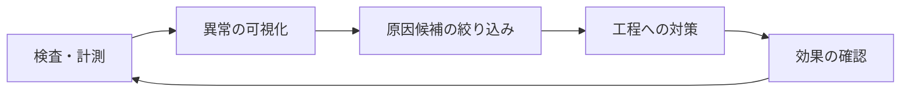

# 検査自動化ソフトから品質改善ソリューションへの方針転換に関する論点整理

## 1. 結論

検査工程の自動化だけでなく、検査データの活用や工程モニタリングを通じて品質改善へ領域を広げる方針は妥当である。

ただし、単に「検査AI＋ダッシュボード」へ機能拡張すると、MES・QMS・IoT基盤・BIベンダーとの競争に巻き込まれ、むしろ差別化が難しくなる。

狙うべき方向は、検査データを起点として、**異常の発見から原因特定、対策、効果確認までを短縮する「品質改善の閉ループ化」**である。

---

## 2. 方針転換の妥当性

従来の検査自動化は、主に「人の判定をAIに置き換える」ことを価値としてきた。一方、品質改善領域では、提供価値の中心が次のように変わる。

| 従来 | 今後 |
|---|---|
| 不良を見つける | 不良を減らす |
| 検査工数を削減する | 損失・手直し・停止を減らす |
| 画像単体を判定する | 製品・設備・条件をひも付ける |
| AI精度が主な指標 | 改善効果と意思決定速度が指標 |
| 検査工程で完結する | 製造・品質・生産技術・設計へ還流する |

これは「Closed-loop Quality」や「Quality 4.0」と呼ばれる方向性と整合する。市場の方向としては妥当であるが、最初から品質全般を扱う大規模プラットフォームを目指すのは危険である。

---

## 3. 特に懸念すべきポイント

### 3.1 競争相手がさらに強くなる

品質改善領域へ広げると、競合は検査AIメーカーだけではなくなる。

- MES・MOMベンダー
- QMSベンダー
- IoT・データ基盤ベンダー
- BI・データ分析ベンダー
- 設備・PLCメーカー
- SIer・コンサルティング会社
- 顧客の内製DX部門

大手ベンダーには全社システム、既存顧客基盤、データ接続資産で勝ちにくい。そのため、「何でもつながる品質プラットフォーム」を正面から掲げるべきではない。

差別化の中心は、**検査画像・判定・欠陥位置・設備条件を理解し、現場で原因究明まで進められる専門性**に置く必要がある。

### 3.2 課題が「AI精度」から「データのひも付け」に移る

品質改善には検査画像だけでは不十分であり、少なくとも次の情報との関連付けが必要になる。

- 個体・シリアル・ロット
- 設備、ライン、金型、治具、工具
- 材料ロット、仕入先
- 温度、圧力、速度、トルクなどの工程条件
- 作業者、シフト、日時
- 品種、レシピ、設計変更
- 手直し、廃棄、後工程、市場不具合
- AIモデルと判定閾値のバージョン

実際の現場では、タイムスタンプのずれ、識別子の不一致、欠測、手入力誤りが頻発する。高度な分析機能より先に、**データモデル、時刻同期、識別子、トレーサビリティの設計**を商品として確立する必要がある。

### 3.3 相関を示すだけでは品質改善にならない

例えば「温度が高いと不良率が上昇する」という分析結果が得られても、温度が真因とは限らない。品種、材料、設備、時間帯などの交絡要因が存在するためである。

品質改善につなげるには、分析結果を次の段階までつなぐ必要がある。

1. 異常傾向を発見する
2. 原因候補をランキングする
3. 根拠となるデータを提示する
4. 現場が仮説を確認する
5. 条件変更や対策を実施する
6. 対策前後の効果を検証する
7. 標準条件・管理値へ反映する

AIに原因を断定させるのではなく、**現場が原因を絞り込む時間を短縮する**設計が現実的である。

### 3.4 顧客ごとの個別開発に陥りやすい

工程、設備、データ形式、品質管理方法は工場ごとに異なる。そのまま個別受託すると、売上は増えても開発・保守負荷が高まり、収益性と横展開性が低下する。

| 標準商品にすべき領域 | 個別対応になりやすい領域 |
|---|---|
| 検査結果・画像の収集 | 独自設備との通信 |
| 欠陥分類・傾向監視 | 顧客固有の品種体系 |
| SPC・変化点検知 | 原因分析ロジック |
| ロット・個体トレース | MES・QMSとの項目対応 |
| 原因候補の探索 | 現場固有の改善ルール |
| 対策前後の比較 | 組織・承認プロセス |

個別対応部分についても、コネクタ、設定ファイル、ローコードによる項目マッピングなどを用意し、再利用可能にする必要がある。

### 3.5 「誰が毎日使うか」が曖昧になりやすい

検査担当者、品質保証、生産技術、製造課長、設備保全、設計では、見たい情報も権限も異なる。購買決定者と日常利用者を分けて設計する必要がある。

| 役割 | 主な関心・利用目的 |
|---|---|
| 班長・検査担当 | 当日の異常確認、処置、画像確認 |
| 品質担当・生産技術 | 傾向分析、原因究明、改善効果確認 |
| 製造課長・品質課長 | 損失、重点問題、改善進捗の管理 |
| 工場長・事業部 | 投資効果、品質KPI、横展開判断 |
| 情報システム・OT担当 | 接続、権限、セキュリティ、保守 |

経営向けダッシュボードだけでは現場に定着しない。現場が毎日実施する朝会、不良レビュー、異常処置、条件変更などの業務プロセスに組み込む必要がある。

### 3.6 効果が検査自動化より測りにくい

検査工数削減は比較的計算しやすいが、品質改善効果は、生産量、品種、材料条件などにも左右される。導入前に効果測定方法を合意しなければ、成果があっても評価されにくい。

推奨するKPIは次の通りである。

- 不良率、直行率、歩留まり
- 手直し費、廃棄費
- 不良流出件数
- 異常発生から検知までの時間
- 検知から原因候補提示までの時間
- 原因究明に要した人時
- 同一不良の再発率
- 工程能力指数
- 検査条件・AIモデルの保守工数
- システム利用率
- 異常から改善案件への移行率
- 改善案件の完了率と効果確認率

単なる画面閲覧回数ではなく、**何件の異常が改善アクションにつながったか**を中間KPIにすることが重要である。

### 3.7 AI検査そのものを軽視してはいけない

品質改善へシフトしても、元になる検査データの信頼性が低ければ分析結果も信頼されない。

- 見逃し、過検出
- 検査条件の変動
- 品種、照明、カメラ変更
- AIモデルの性能劣化
- 欠陥分類の揺れ
- 判定閾値変更の履歴欠落

検査自動化を捨てるのではなく、**品質改善に必要な高品質データを生成する入口**として再定義すべきである。検査技術は顧客の製造現場に入る強い接点であり、将来の品質改善サービスの基盤にもなる。

### 3.8 セキュリティ・責任分界を明確にする必要がある

製造画像や工程条件は、製品設計や製造ノウハウを含む機密情報である。以下を商品企画段階から検討する必要がある。

- オンプレミス、エッジ、クラウドの役割分担
- 工場ネットワークとITネットワークの分離
- データ持ち出し可否と匿名化
- 利用者・部門ごとのアクセス権限
- データ保持期間と削除方針
- モデル、閾値、マスター変更の監査証跡
- 分析結果や推奨条件に対する責任範囲
- 設備へフィードバックする場合の安全性と承認手順

特に、原因推定や条件変更の「推奨」と、設備を自動制御する「実行」では、責任とリスクが大きく異なる。

---

## 4. 推奨するポジショニング

「検査AIメーカー」から、いきなり「製造データプラットフォーム」へ移るのではなく、次の位置を狙うことが現実的である。

> **検査画像・判定結果と工程条件を結び付け、不良原因の絞り込みと改善効果確認を高速化する品質改善ソリューション**

特に、一般的なMESやBIが不得意とする次の領域は差別化候補になる。

- 欠陥画像と工程データの横断分析
- 欠陥の位置・形状・種類別の傾向分析
- 画像特徴量を用いた未知不良のクラスタリング
- 検査閾値変更と不良率変化の追跡
- 誤検出と真の工程異常の切り分け
- 不良発生時点から上流条件を遡る機能
- 対策前後の画像・数値比較
- 品種・設備差を考慮した原因候補提示

この領域では、従来蓄積してきた画像処理、AI、検査現場の知見を参入障壁にできる。

---

## 5. 推奨する商品構成

### レベル1：検査データの見える化

- 不良率、欠陥種別、欠陥位置の分布
- 品種・設備・ロット別の比較
- 集計結果から検査画像へのドリルダウン
- AIの過検出・見逃し管理
- 異常アラート

### レベル2：工程データとの関連分析

- 工程条件との相関探索
- 変化点検知
- 欠陥別の原因候補ランキング
- 良品条件と不良条件の比較
- 設備、材料、シフトなどによる層別

### レベル3：改善活動の支援

- 原因仮説、対策、担当、期限の管理
- 対策前後の統計比較
- 同一不良の再発監視
- 標準条件・管理値への反映
- 類似ライン・他工場への横展開

### レベル4：予兆検知・工程制御

- 不良発生前の予兆検知
- 条件補正の推奨
- 設備へのフィードバック
- 設計・工程設計への品質情報還流

最初からレベル4を目指すと、責任範囲、安全性、データ量、設備接続の問題が一気に増える。まずはレベル1～2で価値を実証し、レベル3へ進むことが望ましい。

---

## 6. 最初の実証テーマの選び方

PoCは「データが多い工程」ではなく、次の条件を満たす工程から選定する。

- 品質損失額または改善ニーズが明確である
- 同じ不良が一定頻度で発生する
- 個体またはロットのひも付けが可能である
- 原因候補となる工程データが取得できる
- 現場に対策を実施できる責任者がいる
- 3～6か月程度で効果を確認できる
- 他ライン・他工場への横展開性がある

一方、次のテーマは初期PoCには適さない。

- 発生頻度が極端に低い不良
- 良否や原因の正解が定義されていない問題
- データ取得だけで大規模な設備改造が必要な工程
- 分析結果が出ても工程条件を変更できないテーマ
- 顧客側の改善責任者が不在のテーマ

---

## 7. 事業化前に明確にすべき項目

1. 誰の、どの業務時間を短縮するのか
2. 既存のMES・QMS・BIではなぜ解決できないのか
3. 検査データを持つ自社だから何ができるのか
4. 導入後3か月で示せる定量効果は何か
5. 個別接続費をどこまで標準化できるか
6. オンプレミス、エッジ、クラウドをどう分担するか
7. 画像や製造条件を外部へ出せない顧客に対応できるか
8. AIの根拠、誤判定、モデル変更を監査できるか
9. 改善提案に対する責任範囲をどこまで負うか
10. 顧客の改善ノウハウを製品へ還元できる契約・運用になっているか
11. 導入後、誰がデータ品質とマスターを維持するのか
12. 他ラインへ横展開した際に再利用できる比率はどの程度か

---

## 8. 推奨する段階的な進め方

### フェーズ1：顧客課題と勝ち筋の検証

- 品質担当、生産技術、製造管理者へのヒアリング
- 原因究明業務の現状フロー整理
- 品質損失と分析工数の定量化
- 既存MES・QMS・BIで解決できない領域の特定

### フェーズ2：限定テーマでのPoC

- 1つの不良、1工程、1ラインに限定
- 検査結果と少数の工程条件をひも付け
- 原因候補提示と対策前後比較を実装
- 技術精度だけでなく、原因究明時間や改善効果を評価

### フェーズ3：共通機能の製品化

- データモデルの標準化
- 設備・MESとの汎用コネクタ整備
- 欠陥傾向監視、層別、変化点検知の部品化
- 利用者別画面と改善ワークフローの整備

### フェーズ4：横展開とサービス化

- 他ライン・他工場への導入
- 導入支援、分析支援、定期レビューのサービス化
- 継続課金につながる運用・保守メニューの整備
- 複数顧客で共通する分析テンプレートの蓄積

---

## 9. 最終提言

本方針は、「AI手法の新規性」で競争する状態から、「顧客の品質損失を継続的に減らす」事業へ移る点で有望である。

一方、対象を広げすぎると、巨大なデータ基盤開発と顧客ごとの個別SIに陥る。そのため、当面の勝ち筋は次のように設定することが望ましい。

> **検査自動化を顧客接点として維持しつつ、検査画像・判定結果・工程条件を統合し、原因究明時間と不良再発率を低減する領域に集中する。**

最新のAI手法は、差別化の看板そのものではなく、変化点検知、類似不良検索、原因候補探索、説明支援など、品質改善ワークフローを強化する内部機能として用いるべきである。

顧客が購入するのはAIモデルではなく、**不良が減り、改善が速く回る仕組み**である。この視点を商品企画、PoC評価、販売方法、収益モデルのすべてに一貫して反映することが重要である。

---

## 参考情報

- [Siemens：Quality Management System（QMS）software solutions](https://www.siemens.com/en-us/solutions/quality-management-qms/)
- [Siemens：Quality control](https://www.siemens.com/en-us/technology/quality-control/)
- [経済産業省：2018年版ものづくり白書―人手不足が進む中での生産性向上の実現に向け](https://www.meti.go.jp/report/whitepaper/mono/2018/honbun/mobile/honbun_mb/101025_mb.html)
- [Scientific Reports：Implementing and evaluating the Quality 4.0 PMQ framework for process monitoring in automotive manufacturing](https://www.nature.com/articles/s41598-025-10226-4)
- [AWS：Computer vision for automated quality inspection](https://docs.aws.amazon.com/wellarchitected/latest/modern-industrial-data-technology-lens/mfgsce5-computer-vision-for-automated-quality-inspection.html)
- [AWS：Toyota—Data-driven quality insights](https://aws.amazon.com/blogs/industries/how-toyota-powers-manufacturing-excellence-and-data-driven-quality-insights/)

